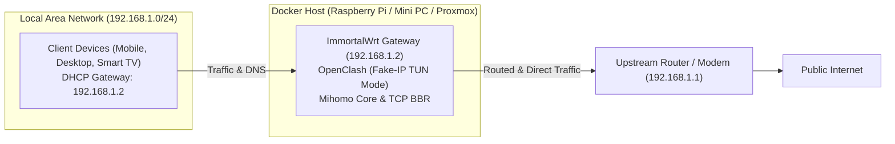
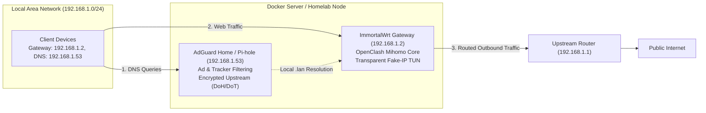
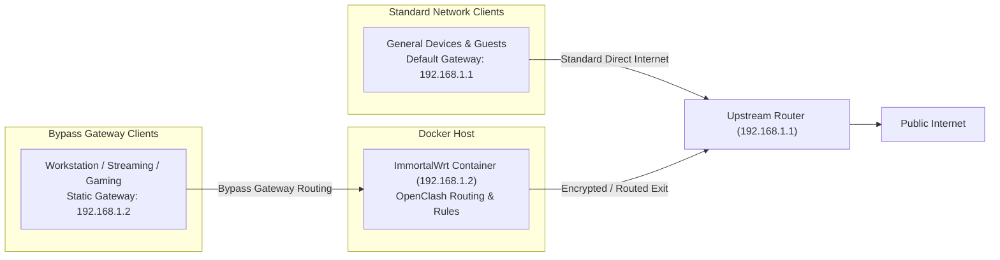
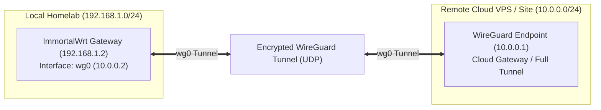

<div align="center">

# ImmortalWrt Gateway for Docker

A turnkey, high-performance **ImmortalWrt 25.12** multi-architecture bypass and sidecar gateway container.  
Pre-integrated with **OpenClash (Mihomo Meta Core)**, WireGuard protocol, **Argon LuCI Interface**, and `nftables` Firewall4.

<p align="center">
  <a href="https://github.com/SwiftExplorer567/immortalwrt-docker/actions/workflows/build-and-publish.yml"></a>
  <a href="https://hub.docker.com/r/hasanjws/immortalwrt-gateway"></a>
  <a href="https://hub.docker.com/r/hasanjws/immortalwrt-gateway"></a>
  <a href="https://hub.docker.com/r/hasanjws/immortalwrt-gateway"></a>
</p>

<p align="center">
  <a href="https://github.com/SwiftExplorer567/immortalwrt-docker"></a>
  <a href="https://github.com/MetaCubeX/mihomo"></a>
  <a href="LICENSE"></a>
  <a href="https://github.com/SwiftExplorer567/immortalwrt-docker"></a>
</p>

<p align="center">
  <a href="#quick-start">Quick Start</a> •
  <a href="docs/GATEWAY_SETUP_GUIDE.md"><b>Master Setup Guide</b></a> •
  <a href="#deployment-topologies">Topologies</a> •
  <a href="#configuration--usage-guidelines">Configuration</a> •
  <a href="https://hub.docker.com/r/hasanjws/immortalwrt-gateway">Docker Hub</a> •
  <a href="https://github.com/SwiftExplorer567/immortalwrt-docker/pkgs/container/immortalwrt-docker">GHCR</a>
</p>

</div>

---

## Feature Comparison

| Feature | Official OpenWrt/ImmortalWrt RootFS | Typical Community Images | **immortalwrt-gateway** |
|---|---|---|---|
| **Multi-Architecture** | ⚠️ x86 only | ⚠️ Single architecture | ✅ **Native Multi-Arch (ARM64 & x86_64)** |
| **Web Management (LuCI)** | ❌ None (CLI only) | ⚠️ Often unthemed / bloated | ✅ **Argon Theme with Dark Mode** |
| **OpenClash & Core** | ❌ None | ⚠️ WebUI only (fails on launch) | ✅ **Pre-embedded Mihomo Binary** |
| **Bypass Gateway Setup** | ❌ Manual setup required | ⚠️ Region-locked defaults | ✅ **Clean nftables & non-conflicting IP** |
| **Localization** | ⚠️ English only | ⚠️ Chinese only | ✅ **English & Turkish out-of-the-box** |
| **Automated Upstream Tracking** | ❌ Manual rebuilds | ❌ Infrequently updated | ✅ **Daily upstream tracking via CI/CD** |

---

## Deployment Topologies

### 1. Full-Network Transparent Bypass Gateway
In this topology, local network clients automatically route outbound traffic through the ImmortalWrt container for transparent proxying, anti-censorship, and zero-leak DNS resolution.



---

### 2. Dual-Stack Gateway with Dedicated DNS Filtering
Combines network-wide ad and telemetry blocking via AdGuard Home or Pi-hole with OpenClash transparent proxying and geo-routing.



---

### 3. Policy-Based Selective Device Routing
Directs specific devices (such as streaming boxes, work workstations, or consoles) through the bypass gateway, while standard household devices continue through the primary ISP router.



---

### 4. Site-to-Site & Remote WireGuard Gateway
Connects local Docker containers to a remote cloud VPS, secondary residence, or corporate network using pre-compiled `kmod-wireguard`.



---

## Pre-installed Package Overview

* **Web Management & Themes:** `luci`, `luci-compat`, `luci-ssl-openssl`, `luci-theme-argon`, `luci-app-argon-config`, `luci-i18n-base-tr`.
* **Proxy & Transparent Routing:** `luci-app-openclash`, `mihomo` (embedded latest Meta core), `dnsmasq-full`, `kmod-tun`, `bash`, `curl`, `ca-bundle`.
* **VPN & Networking:** `luci-proto-wireguard`, `wireguard-tools`, `kmod-wireguard`, `kmod-tcp-bbr`, `kmod-nft-core`, `kmod-nft-nat`, `nftables`, `luci-app-ddns`.
* **Diagnostics & Monitoring:** `luci-app-ttyd` (Web Terminal), `luci-app-nlbwmon` (Bandwidth monitor), `bind-dig`, `iperf3`, `htop`, `nano`.

---

## Quick Start

### 1. Enable Promiscuous Mode
Ensure promiscuous mode is enabled on the host network interface:

```bash
sudo ip link set eth0 promisc on
```

### 2. Docker Compose Deployment

Create a `docker-compose.yml` file:

```yaml
services:
  immortalwrt:
    image: hasanjws/immortalwrt-gateway:latest
    # Or from GHCR:
    # image: ghcr.io/swiftexplorer567/immortalwrt-docker:latest
    container_name: immortalwrt
    restart: unless-stopped
    privileged: true
    cap_add:
      - NET_ADMIN
      - SYS_MODULE
    networks:
      macvlan_lan:
        ipv4_address: 192.168.1.2 # Static IP on your local subnet
    volumes:
      - /lib/modules:/lib/modules:ro
      - ./data/openclash/config:/etc/openclash/config
      - ./data/config:/etc/config

networks:
  macvlan_lan:
    driver: macvlan
    driver_opts:
      parent: eth0 # Replace with your physical network interface (e.g. eth0, enp3s0, end0)
    ipam:
      config:
        - subnet: 192.168.1.0/24      # Match your router subnet
          gateway: 192.168.1.1        # Match your router IP
          ip_range: 192.168.1.2/32
```

Launch the container:

```bash
docker compose up -d
```

### 3. Access Web Interface

* **URL:** `http://<CONTAINER_IP>` (e.g. `http://192.168.1.2`)
* **Username:** `root`
* **Password:** *(none / blank by default)*

---

## Configuration & Usage Guidelines

### Macvlan Host Communication
By default, the Linux kernel prevents direct communication between a host interface and its own macvlan child containers. To enable the host machine to route traffic through the gateway container, establish a macvlan bridge shim:

```bash
sudo ip link add macvlan-shim link eth0 type macvlan mode bridge
sudo ip addr add 192.168.1.250/24 dev macvlan-shim
sudo ip link set macvlan-shim up
sudo ip route add 192.168.1.2 dev macvlan-shim
```

### OpenClash Mode Recommendation
* **Fake-IP TUN Mode (`enhanced-mode: fake-ip`):** Recommended for zero-leak DNS resolution and seamless proxy routing across desktop and mobile platforms.
* **QUIC (HTTP/3) UDP 443 Rejection:** To prevent streaming stalls over proxies, reject UDP port 443 in Clash rules to enforce standard HTTP/2 TCP fallback:
  ```yaml
  rules:
    - AND,((DST-PORT,443),(NETWORK,UDP)),REJECT
  ```

---

## Building Locally

To build root filesystems and container images manually on Linux or WSL2:

```bash
# Clone repository
git clone https://github.com/SwiftExplorer567/immortalwrt-docker.git
cd immortalwrt-docker

# Install dependencies
sudo apt-get update && sudo apt-get install -y \
  build-essential libncurses5-dev zlib1g-dev gawk git gettext \
  libssl-dev xsltproc rsync wget unzip python3 zstd curl jq qemu-utils \
  genisoimage dosfstools mtools libelf-dev
chmod +x scripts/build.sh

# Option A: Build for ARM64 (Raspberry Pi / SBCs)
./scripts/build.sh armsr/armv8 25.12.1 ./build_output
cp ./build_output/rootfs-armsr-armv8.tar.gz ./rootfs.tar.gz
docker build -t immortalwrt-gateway:local .

# Option B: Build for x86_64 / AMD64 (Mini PCs / Proxmox / VMs)
./scripts/build.sh x86/64 25.12.1 ./build_output
cp ./build_output/rootfs-x86-64.tar.gz ./rootfs.tar.gz
docker build -t immortalwrt-gateway:local .
```

---

## Registries & Continuous Delivery

* **Docker Hub:** [`hasanjws/immortalwrt-gateway`](https://hub.docker.com/r/hasanjws/immortalwrt-gateway)
* **GitHub Container Registry:** [`ghcr.io/swiftexplorer567/immortalwrt-docker`](https://github.com/SwiftExplorer567/immortalwrt-docker/pkgs/container/immortalwrt-docker)

### Official Release Tags

| Docker Tag | Target Base | Description |
|---|---|---|
| **`:latest`**, **`:stable`**, **`:25.12.1`**, **`:25`** | **ImmortalWrt 25.12.1 (Latest)** | **Official Production Release.** Turnkey high-performance gateway container with Linux 6.6, nftables Firewall4, Argon theme, and embedded Mihomo Meta core. |

Automated build workflows execute daily at 01:00 UTC to track upstream ImmortalWrt 25.x releases, publishing multi-arch manifests (`linux/arm64` and `linux/amd64`).

---

## Frequently Asked Questions

<details>
<summary><b>1. Why is the Mihomo core pre-bundled?</b></summary>
Standard OpenClash requires downloading the Mihomo core binary upon initial container initialization. In containerized environments without existing DNS or internet routing, this creates a bootstrap dependency deadlock. Pre-embedding the binary ensures turnkey operation upon launch.
</details>

<details>
<summary><b>2. Should DMZ be enabled on the primary router?</b></summary>
No. In a sidecar/bypass gateway topology, the container processes outbound network traffic. Enabling DMZ forwards all unsolicited inbound ports from the WAN to the container, which is unnecessary and presents a security exposure.
</details>

<details>
<summary><b>3. How are DHCP conflicts prevented?</b></summary>
If the DHCP server is enabled on ImmortalWrt, disable the DHCP server on the upstream modem/router to prevent competing DHCP offers on the broadcast domain.
</details>

---

## License & Legal Notices

* **License:** Licensed under the [GNU General Public License v3.0](LICENSE).
* **Disclaimer:** Provided for research, network testing, and homelab educational purposes only. Maintainers do not operate, host, or distribute proxy servers, VPN credentials, or third-party routing nodes.
